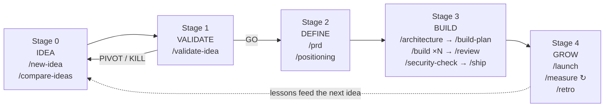

# Solo Founder Workflow for Claude Code

An idea-to-launch operating system for a solopreneur, built on Claude Code. It covers the whole arc — capturing and vetting ideas, validating demand, defining the product, building and shipping it, launching, and measuring — with lightweight stage gates, honest evidence rules, and a knowledge base that makes every idea cheaper than the last one.

**Design stance:** staged but lightweight. One-page artifacts, binary gate verdicts, and a built-in adversary that attacks your plans so the market doesn't have to. Security is one pragmatic pre-ship gate, not a parallel bureaucracy.

## How to use it

This is a **template repo** — one clone per idea:

1. Click **Use this template** on GitHub (or `git clone` + re-init) to start a new project.
2. Open it in Claude Code. The workflow's commands, agents, and rules load automatically from `.claude/` and `CLAUDE.md`.
3. Start with `/new-idea <your idea>` — or `/validate-idea` if you're already committed to it.
4. Copy `docs/templates/status.md` to `docs/00-status.md` (the first command you run will do this for you if you forget).

**Read `docs/PLAYBOOK.md`** for the narrative version: the full idea-to-launch arc, the weekly/monthly cadence, and the fast lanes.

Keep one clone as your **portfolio hub** if you like — a place where `/new-idea` and `/compare-ideas` manage the backlog before an idea graduates to its own repo.

## The lifecycle



Each stage ends in a **gate** with a binary verdict (GO/PIVOT/KILL, APPROVED/NEEDS_FIX, PASS/FAIL). Gates can be waived — on the record in `docs/00-status.md`, never silently.

## Commands

| Command | Stage | What it does |
|---|---|---|
| `/new-idea <desc>` | 0 | Capture an idea, ICE-score it stingily, name its riskiest assumption |
| `/compare-ideas` | 0 | Rank the backlog, recommend exactly one next bet (killing is a valid answer) |
| `/validate-idea` | 1 | Market research, competitor scan, honest TAM, Proof-of-Life probe → **GO / PIVOT / KILL** |
| `/prd` | 2 | One-page PRD: core loop, testable ACs, explicit out-of-scope, measurable success metrics |
| `/ux-design` | 2 | Screen flow + the critical screen + every state (empty/loading/error) designed on paper before build; customer-voice walks the flow |
| `/positioning` | 2 | Positioning statement (Moore format), press-release paragraph, pricing hypothesis |
| `/architecture` | 3 | 1–2 page brief covering only expensive-to-reverse decisions (data model, RLS ownership, lock-ins) |
| `/build-plan` | 3 | Vertical-slice phases, each with verification defined *before* implementation |
| `/build [phase]` | 3 | Implement a phase; done only when the plan's own checks pass unmodified |
| `/review` | 3 | code-reviewer + adversary in parallel, scoped fix loop (max 3) → **APPROVED / NEEDS_FIX** |
| `/security-check` | 3 | The one security gate: secrets, auth, RLS, input validation, Stripe integrity, deps → **PASS / FAIL** |
| `/ship` | 3 | Deploy: pre-flight with captured output, migrations, smoke test, written rollback plan |
| `/launch` | 4 | Evidence-based channel pick, ready-to-publish copy, day-1 checklist, day-2+ motion |
| `/measure` | 4 | Metrics vs. the PRD's own targets; names the binding constraint; honest-exit check |
| `/retro` | 4 | Harvest lessons/assumptions/decisions into `docs/knowledge/` — the compounding asset |
| `/ci-pipeline` | 3 | Generate GitHub Actions CI (lint/typecheck/test on PR) so /ship's CI gate exists |
| `/observability` | 3 | Error tracking (Sentry), uptime checks, and a page-me-vs-digest alert policy — verified with a real test event |
| `/ai-integrate <feature>` | 3 | LLM features the disciplined way: design ADRs, versioned prompts, evals as the gate, cost/injection guardrails |
| `/design-review` | 3/4 | Pre-launch UI polish pass: catches generic-AI-slop tells (default-theme look, placeholder residue, state poverty) |
| `/perf-audit` | 3/4 | Latency (N+1s, bundles, slow queries) + per-user unit cost (LLM/API) vs. pricing's margin floor |
| `/watch-competitors` | 4 | Re-runnable diffable competitor/pricing snapshot; reports material changes only; cron/Routine-schedulable |
| `/grow` | 4 | Day-scale growth experiments against the binding constraint, pre-registered thresholds, graded by /measure — backed by the growth-tactics playbook (CRO, dunning, lifecycle email, SEO, B2B sales) |
| `/feedback` | 4 | Capture and theme user feedback (support, cancellations, public mentions) into a ledger that /measure and /roadmap read |
| `/roadmap` | 4 | Sequence the next 1–3 releases from /measure's binding constraint + feedback themes + deferred backlog, each with a testable hypothesis |
| `/workflow-status` | any | Where am I, which gates are open, exactly one next action |
| `/continue-work` | any | Resume from wherever the project actually stands |
| `/adversary <target>` | any | Hostile review of any artifact, diff, or decision on demand |
| `/hotfix <what broke>` | any | Emergency lane: root-cause, minimal fix, scoped review, ship, backfill — ceremony compressed, honesty not |
| `/sync-template` | any | Pull workflow improvements from the template repo into this project (never touches project artifacts) |
| `/ops-check` | any | Quarterly ops health: **tested** backup restore, dependency updates, credential/emergency-access hygiene, cost drift, continuity doc |
| `/sunset` | 4 | Deliberate end of life: sell-mode acquisition prep first, else a wind-down that treats users well and harvests the lessons |
| `/portfolio` | hub | From the portfolio hub: read every product's state, allocate the founder's week (WIP limit enforced), move lessons between living products |

## Agents

Agents exist only where fresh context or a distinct stance earns them — judgment lives in agents, procedure lives in commands.

- **adversary** — read-only hostile reviewer: assumes the artifact is wrong and tries to prove it. Standing gates at validation, PRD, build plan, review, and launch; on demand everywhere else. The co-founder who says no.
- **code-reviewer** — production-readiness: plan conformance, prohibited-behavior scan, correctness, real tests. Binary verdict, evidence required.
- **security-reviewer** — pragmatic pre-ship gate tuned to how indie SaaS actually gets breached (IDOR, missing RLS, leaked keys, unverified webhooks), with negative tests for fixed findings.
- **research-analyst** — protocol-enforcing researcher for market/competitor/demand sweeps: every claim labeled and dated, absence-of-evidence reported as a finding. Dispatched by `/validate-idea` and `/watch-competitors`.
- **customer-voice** — simulates the validated target persona reacting to copy, onboarding, and pricing with realistic confusion and indifference. A cheap filter before real users see it — its reactions are never validation evidence, and it says so itself.
- **design-reviewer** — fresh-context UI judge for `/design-review`: walks the running app with Playwright, hunts slop tells and a11y failures, judges against the UX-design artifact rather than abstract taste.

## The rules that keep it honest

- **[FACT] / [INFERENCE] / [ASSUMPTION]** labels on every research claim, with dated sources (`.claude/references/research-protocol.md`). Unlabeled = assumption.
- **Claims are not evidence** — "tests pass" and "competitor charges $29" both require captured output or a source.
- **Prohibited behaviors** (`.claude/references/prohibited-behaviors.md`) — the nine ways AI-assisted work quietly cheats (loosened tests, silent scope cuts, fabricated evidence…), each with a recovery protocol: STOP → REVERT → DOCUMENT → FIX → VERIFY.
- **Knowledge compounds** — `docs/knowledge/` holds lessons, an assumption ledger, and a decision log. Commands read it before authoring and never silently re-litigate a recorded decision.

## Artifacts

```
docs/
├── 00-status.md            single source of truth: stage, gate ledger, waivers, log
├── PLAYBOOK.md             the founder's operating manual — start here
├── ideas/<slug>.md         the portfolio, killed ideas included
├── product/                01-validation, 02-prd, 03-positioning, 04-roadmap, 05-ux-design
├── engineering/            01-architecture, 02-plan, 03-review, 04-security, 05-ship,
│                           06-design-review, 07-hotfixes, 08-perf-audit,
│                           09-observability, 10-ai-integration, 11-ops
├── launch/                 01-launch-plan, 02-metrics, 03-competitor-watch,
│                           04-feedback, 05-experiments
├── knowledge/              lessons, assumptions, decisions — the compounding asset
└── templates/              the blank forms each command fills in
```

## Right-sizing: when to skip phases

| Situation | Run |
|---|---|
| New idea, uncommitted | Full pipeline from Stage 0 |
| Committed idea, greenfield | Start at `/validate-idea` |
| New feature in a shipped product | `/prd` (mini) → `/build-plan` → `/build` → `/review` → `/ship` |
| Bug fix | `/build` (as a one-phase plan) → `/review` → `/ship` |
| Copy/UI tweak | Just do it; `/review` if it touches the funnel |
| Anything touching auth, payments, or data access | Never skip `/security-check` |

## Stack

Opinionated defaults in `.claude/references/stack.md`: Next.js + TypeScript, Supabase (RLS everywhere), Vercel, PostHog, Stripe, Resend; React Native + Expo for mobile. Override per project with a `## Stack` section in `CLAUDE.md` — commands respect the override.

Other references: `saas-finance.md` (metric formulas, indie benchmarks, traps), `growth-tactics.md` (execution playbooks per funnel constraint, incl. founder-led B2B sales), `compliance.md` (launch legal basics: privacy, ToS, consent, Stripe Tax — gated at first deploy), `research-protocol.md`, `prohibited-behaviors.md`.

## Customizing the workflow

The workflow itself only changes in the template repo, deliberately. `/retro` collects "workflow friction" entries in each project; when a friction recurs, edit the command here and every future project inherits the fix. Commands are plain Markdown in `.claude/commands/` — edit freely. Useful upgrade paths: add `model:` frontmatter to route heavy phases to a stronger model; connect the Supabase/Vercel/PostHog MCP servers so `/ship` and `/measure` can act directly instead of producing checklists.

## Credits

Ideas gratefully borrowed and adapted from:
[DenizOkcu/claude-code-ai-development-workflow](https://github.com/DenizOkcu/claude-code-ai-development-workflow) (phase pipeline, scoped fix loops, evidence discipline) ·
[vakaobr/claude-code-ai-development-workflow](https://github.com/vakaobr/claude-code-ai-development-workflow) (the fork this template rebalances) ·
[UnpaidAttention/claude-code-ultimate-sdlc-framework](https://github.com/UnpaidAttention/claude-code-ultimate-sdlc-framework) (prohibited-behavior catalog, gate discipline) ·
[deanpeters/Product-Manager-Skills](https://github.com/deanpeters/Product-Manager-Skills) (PM frameworks: PoL probes, positioning, pricing advisors, fact/inference/assumption labeling) ·
[atelier-fashion/adlc-toolkit](https://github.com/atelier-fashion/adlc-toolkit) (adversary reviewer, knowledge compounding, validation gates).
