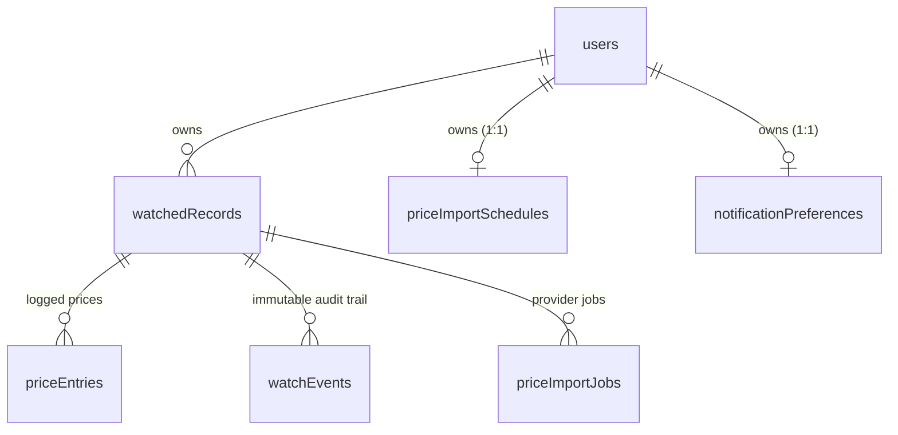

# Architecture Brief: DropWatch application (`app/`)

- **Date:** 2026-08-29 — **Stack:** default per `.claude/references/stack.md`, deviations listed below
- **Scope:** the application in `app/`, merged in #16 and **not deployed**. The landing page at the repo root is out of scope and unchanged.
- **Deliverable:** brief only. Nothing here is implemented.

> **Input gap [FACT]:** `docs/product/02-prd.md` does not exist — the PRD gate has not run. Scope below is taken from `docs/product/00-brief.md`, which the brief itself declares the source of truth ("if anything in this repo conflicts with this brief, the brief wins"). Every scope claim here traces to that file. A `/prd` pass post-GO could still move these lines.

## Verdict: keep it, on four conditions

**[INFERENCE]** The app is the real MVP, not a prototype to rebuild — but only after the vendor dependencies below are cut. The evidence:

| MVP feature (`00-brief.md`) | Implemented in `app/` |
|---|---|
| 1. Plain-English Alert Builder | `watchAi.parseAlertRequest` + `watchedRecords.createFromRequest` |
| 2. Alert dashboard (view/edit/pause/delete) | `list` / `get` / `update` / `setStatus` / `remove` |
| 3. Paste-a-price tracker + history chart | `logPrice`, `priceEntries`, `PriceHistory` |
| 4. Threshold email alert | `notifications.sendThresholdEmail` (Postmark) |
| 5. Deal-quality verdict | `watchAi.writeDealVerdict` |

All five are present, typechecked, and covered by a suite that passes on a clean checkout (50 passed / 9 skipped). Authorization is correct — every watch operation is a `protectedProcedure` threading `ctx.user.id` into the query, with a uniform `notFound()` that does not leak existence. **[FACT: verified by reading `server/routers.ts` in full during the #16 review.]**

Against that, a rebuild reproduces the same five features and the same domain logic — the trust layer's landed-cost and confidence rules are ~1,300 lines of genuine, tested product thinking — at multi-week cost and zero product learning.

The lock-in that argues for a rebuild is real but **shallow and already isolated**. Four Manus dependencies, each behind exactly one module in `server/_core/`:

| Dependency | Module | Depth |
|---|---|---|
| OAuth identity | `sdk.ts` | Sessions are our own HS256 JWTs; only identity lookup is Manus |
| LLM gateway | `llm.ts` | `forge.manus.im/v1/chat/completions` — **OpenAI-compatible**, so a swap is an adapter |
| Object storage | `storageProxy.ts` | Used by nothing in the product path |
| Cron scheduling | `heartbeat.ts` | Registers tasks, calls back to `/api/scheduled/*` |

`_core/` being the seam is the single best thing about this codebase: the vendor surface is already fenced off from the product logic. That is what makes "keep and cut" cheaper than "rebuild".

**Conditions.** Keeping it is only correct if all four happen before launch — the first two while the app's database still holds zero rows, which is the cheapest this will ever be:

1. MySQL → Supabase Postgres, with RLS on every table
2. Manus OAuth → Supabase Auth
3. Manus LLM gateway → Anthropic direct
4. Delete the dead vendor surface (~827 lines, plus `ComponentShowcase.tsx`)

**Do not start any of this until validation returns GO** (decision date 2026-09-12). The app earns nothing before then, and a KILL verdict makes all of it waste.

## Data model

Seven tables. `users.id` is the ownership root; every other table reaches it in one hop, which makes RLS mechanical rather than clever.

- **users** — `openId` (unique, external identity), email, `role` enum(user|admin). The `openId` column is the auth seam: it holds a Manus identifier today and a Supabase `auth.users.id` after migration.
- **watchedRecords** — the core entity. `userId` FK cascade; `originalRequest` (the user's sentence), `productName`, `stores`, `sources`, `thresholdCents`, `alertBasis` enum(item_price|estimated_total|verified_total), `destinationPostalCode`, `observationMode`, `status` enum(active|paused|triggered|deleted). **Soft-deleted** via `status`, not a row delete.
- **priceEntries** — logged/imported prices with landed-cost evidence (shipping, tax, condition, availability, `costConfidence`).
- **watchEvents** — append-only audit trail, 13 event types. Never updated.
- **priceImportSchedules** — one per owner (`ownerId`, unique index), holds `scheduleCronTaskUid`.
- **notificationPreferences** — one per user, with a unique `unsubscribeToken`.
- **priceImportJobs** — provider jobs keyed by unique `providerJobId`.

**Expensive-to-reverse choices flagged:** soft-delete on `watchedRecords` (status, not deletion — a hard delete later loses history and breaks `watchEvents` FKs); append-only `watchEvents` (an event-sourced audit trail whose semantics are hard to change once users have history); and the two 1:1 tables, which are only 1:1 by unique index and would need a real migration to become 1:N.

**RLS, once on Postgres:** every table gets `USING (user_id = auth.uid())`, reached via `watchedRecords` for the three child tables. `watchEvents` additionally gets no UPDATE or DELETE policy at all, so the audit trail is immutable at the database rather than by convention. Today there is **no RLS whatsoever** — the security model is app-layer only, which is correct as far as it goes but is a single bug away from cross-tenant reads, and it violates the "RLS on every table, no exceptions" rule in `stack.md`.

## System shape (deviations from the default stack)

| Area | Default | DropWatch app | Why it deviates |
|---|---|---|---|
| Framework | Next.js App Router | Vite SPA + Express + tRPC | Inherited from the Manus scaffold. **Not worth changing** — tRPC gives end-to-end types and the rewrite buys nothing a user can see. |
| Database | Supabase Postgres | MySQL via `mysql2` | Scaffold default. **Change it** (ADR-2). |
| Auth | Supabase Auth | Manus OAuth | Scaffold default. **Change it** (ADR-3). |
| Email | Resend | Postmark | Already integrated and tested. Not worth churn; revisit only if Postmark's sender review stalls. |
| LLM | — | Manus forge gateway | **Change it** (ADR-4). |

**External dependencies — failure mode and cost at 10×:**

- **Anthropic (after ADR-4)** — used on two paths: alert parsing (once per watch created) and deal verdict (once per price logged). Down → `createFromRequest` fails and must fall back to the manual form, which already exists; verdicts are skippable. Cost is per-event, not per-poll, so 10× users ≈ 10× cost and stays small; the failure mode is graceful because neither call is on a read path.
- **PriceAPI** — down → imports fail, logged in `watchEvents` as `import_failed`, manual price logging unaffected. **Cost is the risk here: PriceAPI bills per job, and jobs are `active watches × sources`, so 10× users is 10× spend with no natural ceiling.** `requestPriceImports` caps a batch at 100, which bounds one run, not the bill.
- **Postmark** — down → `sendThresholdEmail` returns `{status:"skipped"}` and the event is recorded; alerts are visible in-app. Degrades correctly.
- **Supabase (after ADR-2/3)** — down → the app is down. Same blast radius the landing page already accepts.

**Scope finding [FACT].** `00-brief.md` lists "live retailer API integrations or automated price polling" under **Not in the MVP**. The app implements exactly that: PriceAPI job queuing, cron-scheduled imports, import health, and the trust layer that grades imported offers. Roughly a third of the server product code serves a feature the brief excludes. This is not a defect — the code is good and the trust layer is the most interesting thing in the repo — but it should not be on the launch path. **Recommendation: ship MVP with manual price logging only; leave the import code in place with schedules disabled.** That also defuses the unbounded PriceAPI cost above, and it is a configuration decision, not a deletion.

## Decisions (mini-ADRs)

| Decision | Why | Revisit when |
|---|---|---|
| **ADR-1.** Keep the Manus-generated app as the MVP; do not rebuild | All 5 MVP features implemented, authorization verified correct, ~1,300 lines of tested domain logic in the trust layer, and the vendor surface is already isolated behind 4 modules in `_core/`. A rebuild costs weeks and reproduces the same features | Two or more of ADR-2/3/4 prove materially harder than estimated, or validation returns KILL |
| **ADR-2.** Migrate MySQL → Supabase Postgres with RLS on every table | `stack.md` requires RLS with no exceptions; the landing page's `dropwatch_leads` is already Supabase. The app's database holds zero rows, so this is the cheapest it will ever be. Running two engines for one solo product is unjustified | Never, unless a Postgres-specific limit appears. If deferred past first real user, the cost rises sharply |
| **ADR-3.** Replace Manus OAuth with Supabase Auth | Auth is the deepest lock-in to the platform being left, and logins break entirely if Manus goes away. Comes largely free with ADR-2, and `users.openId` is already the seam | Bundle with ADR-2 — doing them separately means migrating identity twice |
| **ADR-4.** Replace the Manus LLM gateway with Anthropic direct | The two hero features (alert parsing, deal verdict) run through `forge.manus.im`. The endpoint is OpenAI-compatible `/v1/chat/completions`, so this is an adapter in `_core/llm.ts` plus a key — the shallowest of the four cuts, on the most user-visible path | Cost per parse becomes material at scale, which would argue for a smaller model, not a different vendor |
| **ADR-5.** Host on Vercel as serverless functions, not a container host | Consolidates on a platform already paid for and understood, gives per-PR preview deploys matching `stack.md`, and Vercel Cron replaces the Manus heartbeat. tRPC has a first-class Vercel adapter; the SPA is already static. Free at validation-scale volume | Something genuinely needs a long-running process — a websocket, or an import worker outliving a function timeout. Then Railway/Render at ~$5/mo, which is the fallback if the app must run *this week* |
| **ADR-6.** MVP launches with manual price logging; automated imports stay disabled | `00-brief.md` excludes automated polling from the MVP, and PriceAPI cost scales as watches × sources with no ceiling. Keeping the code and disabling the schedule preserves the work at zero cost | Validation shows users will not log prices by hand — which is the most likely way this brief is wrong (see below) |
| **ADR-7.** Delete dead vendor surface; keep the historical planning files | `dataApi.ts`, `imageGeneration.ts`, `map.ts`, `voiceTranscription.ts` (827 lines) have zero importers, as does `ComponentShowcase.tsx`. Dead code with vendor API calls is a maintenance and security liability. `repo-sync-plan.md` and `readiness-roadmap.md` record *why* the migration happened and stay | A deleted module is needed again — git history has it |

## Risk paragraph

**The part most likely to be wrong is ADR-6 — that users will log prices by hand.** The whole MVP, as the brief scopes it, asks the user to paste a product link and its current price to build history. But the brief's own target user is defined by *not* having time to babysit prices, and its demo moment shows a fully automatic alert arriving eleven days later with no user action in between. If the MVP ships manual-only, the product may demo beautifully and then be abandoned after two manual entries, and we would misread that as "no demand" when it was "wrong mechanic". This is also the one risk the validation probe **cannot** detect: the landing page sells the automatic experience, so email signups measure appetite for automation, not willingness to log prices.

We would find out early by making the first cohort's behaviour the metric that matters — specifically, **median manual price entries per user in week one, and what share of users log a second price at all.** If that share is low, the answer is not more polish: it is to move automated imports onto the launch path, accept the PriceAPI cost, and re-scope the MVP. That is a cheap correction precisely because ADR-6 disables the import code rather than deleting it.

A secondary risk, worth one line: ADR-2 and ADR-3 are estimated as cheap *because* the app's database is empty. That estimate expires the moment a real user signs up. If validation returns GO, these two migrations should come before the first invite goes out, not after.

## Next

`/prd` to close the input gap above, then `/build-plan`. Neither before the validation gate resolves.
